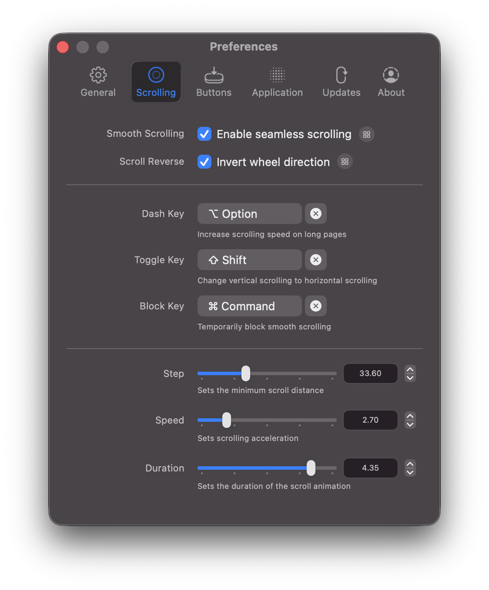

<p align="center">
  <a href="https://mos.caldis.me/">
    
  </a>
</p>

<h1 align="center">Mos</h1>

<p align="center">
  Bikin scroll roda mouse di macOS sehalus trackpad, sambil tetap mempertahankan presisi mouse.
</p>

<p align="center">
  <a href="https://github.com/Caldis/Mos/releases"></a>
  
  
  <a href="LICENSE"></a>
</p>

<p align="center">
  <a href="README.md">中文</a> ·
  <a href="README.enUS.md">English</a> ·
  <a href="README.ru.md">Русский</a> ·
  <a href="README.id.md">Indonesia</a>
</p>

<p align="center">
  <a href="https://mos.caldis.me/">Homepage</a> ·
  <a href="https://github.com/Caldis/Mos/releases">Download</a> ·
  <a href="https://github.com/Caldis/Mos/wiki">Wiki</a> ·
  <a href="https://github.com/Caldis/Mos/discussions">Discussions</a>
</p>

<p align="center">
  
</p>

## Kenapa Mos

Scroll roda mouse di macOS sering terasa kasar: gerakannya kurang punya inersia yang mulus dan mudah diprediksi seperti trackpad. Mos menangkap event roda mouse dan mengubah delta mentah menjadi scroll yang lebih halus, sambil tetap memberi kamu kendali atas aplikasi, arah scroll, dan tombol.

Mos adalah utilitas menu bar gratis dan open-source untuk macOS 10.13 ke atas.

## Fitur Utama

- **Scroll halus**: atur langkah minimum, gain kecepatan, dan durasi, atau aktifkan mode simulasi trackpad.
- **Sumbu independen**: atur smoothing dan arah reverse secara terpisah untuk scroll vertikal dan horizontal.
- **Hotkey scroll**: ikat tombol kustom untuk akselerasi, konversi arah, dan menonaktifkan sementara scroll halus.
- **Profil per aplikasi**: tiap App bisa mewarisi pengaturan global atau memakai aturan scroll, shortcut, dan button binding sendiri.
- **Button binding**: rekam event mouse, keyboard, atau event kustom, lalu ikat ke aksi sistem, shortcut, membuka App, menjalankan skrip, atau membuka file.
- **Dukungan Logi/HID++**: mendukung event tombol Logitech dari receiver Bolt, Unifying, dan perangkat Bluetooth langsung, termasuk aksi khusus Logi.
- **Daftar aksi**: aksi bawaan untuk Mission Control, Spaces, screenshot, operasi Finder, edit dokumen, scroll mouse, dan lainnya.

## Screenshot

| Pengaturan scroll | Profil per aplikasi |
| --- | --- |
|  |  |

| Buka App, skrip, atau file | Daftar aksi |
| --- | --- |
|  |  |

## Download & Install

### Instal Manual

Unduh versi terbaru dari [GitHub Releases](https://github.com/Caldis/Mos/releases), unzip, lalu pindahkan `Mos.app` ke `/Applications`.

Saat pertama kali dibuka, macOS mungkin meminta izin Accessibility untuk Mos. Mos membutuhkan izin ini untuk membaca dan menulis ulang event scroll. Kalau aplikasi masih belum berjalan setelah izin diberikan, lihat [panduan troubleshooting izin](https://github.com/Caldis/Mos/wiki/If-the-App-not-work-properly).

### Homebrew

Kalau kamu lebih suka mengelola aplikasi lewat Homebrew:

```bash
brew install --cask mos
```

Untuk update:

```bash
brew update
brew upgrade --cask mos
```

## Development

Mos dibangun dengan Swift 5, AppKit, Xcode, dan Swift Package Manager. Perintah umum:

```bash
xcodebuild -scheme Debug -configuration Debug -destination 'platform=macOS' build
xcodebuild -scheme Debug -destination 'platform=macOS' test
```

Perubahan yang menyentuh Logi/HID, Accessibility, signing, notarization, update aplikasi, atau pengujian perangkat nyata punya risiko lebih tinggi. Tolong jelaskan konteksnya dulu lewat issue atau Discussions.

## Contributing

Mos menangkap input sistem, memakai izin Accessibility, bekerja dengan perangkat Logi/HID, dan menyimpan konfigurasi pengguna. Biaya maintenance dan risiko regresi itu nyata, jadi kami lebih menyukai perubahan kecil dan fokus.

Di deskripsi PR, jelaskan motivasi, cara pengujian, dan kemungkinan dampak perilakunya.

> Kode yang dibuat dengan AI sudah menjadi hal umum, dan kami paham banyak PR sekarang dibuat dengan bantuan AI, termasuk pekerjaan kami sendiri. Tetapi pengirim PR tetap perlu memahami, merapikan, dan memverifikasi apa yang dilakukan setiap baris kode, karena setiap review PR punya biaya.

### Sangat Disambut

- Bug fix kecil dengan langkah reproduksi atau catatan validasi.
- Perbaikan UI/UX kecil, seperti layout, copy, keterbacaan, dan onboarding.
- Hardening keamanan kecil, seperti penanganan status izin yang lebih aman, proteksi input, dan boundary check.
- Perbaikan lokalizasi, dokumentasi, dan test.
- PR satu topik dengan perubahan baris terbatas dan mudah direview.

### Belum Akan Kami Merge Untuk Saat Ini

- Fitur baru besar, modul baru, atau perubahan arsitektur besar yang belum didiskusikan lebih dulu.
- Rewrite massal hasil AI, sweeping format, migrasi besar, atau “sekalian bersih-bersih”.
- Perubahan perilaku yang memengaruhi penanganan input event, prompt izin, update aplikasi, pembacaan data pengguna lama, atau format konfigurasi tersimpan.
- Paket terjemahan mesin dalam jumlah besar, terutama jika tidak bisa diperiksa oleh penutur asli.

Kami menyambut semua bentuk kontribusi. Kalau ada saran atau masukan, silakan buka [issue](https://github.com/Caldis/Mos/issues).

Kalau kamu sangat tertarik pada sebuah fitur, mulai dulu dari [Discussions](https://github.com/Caldis/Mos/discussions).

## Thanks

- [Charts](https://github.com/danielgindi/Charts)
- [LoginServiceKit](https://github.com/Clipy/LoginServiceKit)
- [Sparkle](https://github.com/sparkle-project/Sparkle)
- [Smoothscroll-for-websites](https://github.com/galambalazs/smoothscroll-for-websites)
- [Solaar](https://github.com/pwr-Solaar/Solaar)

## License

Copyright (c) 2017-2026 Caldis. All rights reserved.

Mos dilisensikan dengan [CC BY-NC 4.0](http://creativecommons.org/licenses/by-nc/4.0/). Jangan unggah Mos ke App Store.
